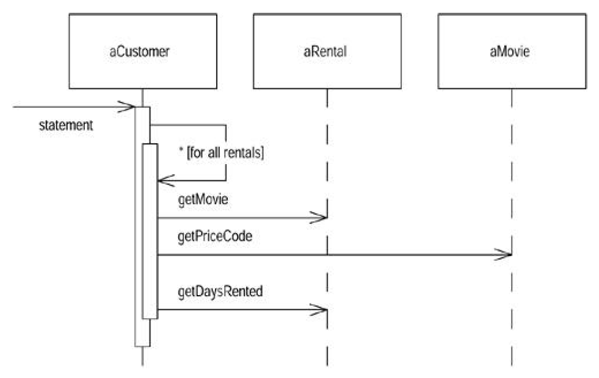
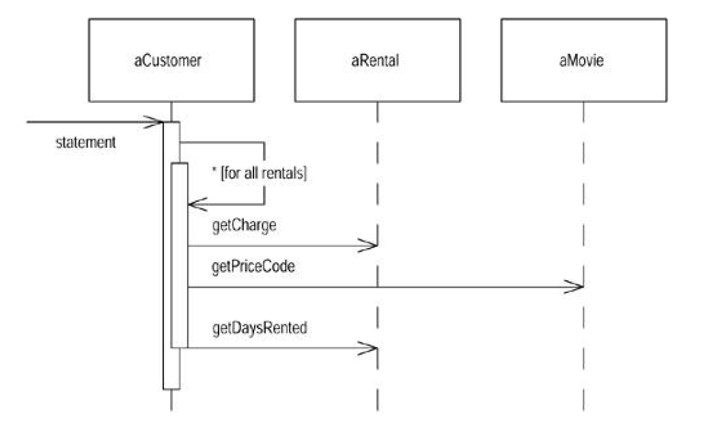

#Especificaciones de Refactoring

Partís de unas clases definidas en Java con el siguiente diagrama de relaciones:

Customer también tiene un método que produce un statement con las interacciones que se muestra a continuación:

**Por la naturaleza de los cambios a realizar, sólo necesitáis trabajar sobre una única rama en Git.**

## Refactorización 1
Simplificar el método statement de la clase Customer mediante la extracción de un método público llamado **amountFor** 
que contenga la lógica que distingue entre Movie.REGULAR, Movie.NEW_RELEASE y Movie.CHILDRENS, para aplicar diferentes 
tarifas de alquiler. Se pretendo con ello tener un método statement más sencillo y fácil de mantener. Además deberá 
devolver un **double**.

Tras comprobar que el cambio está correcto, realizar un commit en vuestro repositorio local.

## Refactorización 2
Deberá mover el método amountFor implementado por el miembro 1 de la clase Customer a la Rental para nombrarlo
**getCharge()**, privado, que devuelva un double y que realize la misma funcionalidad. Para ello, en Customer, tendremos 
que realizar los cambios oportunos.

Tras comprobar que el cambio está correcto, realizar un commit en vuestro repositorio local.

## Refactorización 2
Simplificar el método statement de la clase Customer mediante la extracción de un método público llamado 
**getFrequentRenterPoints()** que contenga la lógica que distingue aquellas películas que son novedades y con más de un
día de alquiler para devolver 2 o, en caso contrario, 1.

Tras comprobar que el cambio está correcto, realizar un commit en vuestro repositorio local y realizar un pull al 
remoto.

El resultado del refactoring tiene que tener la siguiente relaicón y diagrama de clases:

